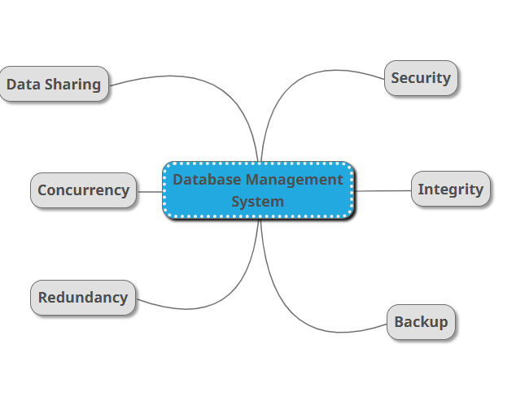

Comparison: Flat File Systems vs. Relational Databases
| Feature             | Flat File Systems                                 | Relational Databases                                  |
| ------------------- | ------------------------------------------------- | ----------------------------------------------------- |
| **Structure**       | Data stored in plain text or binary files         | Data organized in tables with rows & columns          |
| **Data Redundancy** | High – data often repeated across files           | Low – normalization reduces redundancy                |
| **Relationships**   | No inherent relationships between files           | Foreign keys and joins define relationships           |
| **Example Usage**   | CSV files, log files, Excel spreadsheets          | MySQL, PostgreSQL, Oracle DB                          |
| **Drawbacks**       | Difficult to scale, update, and query efficiently | Complex setup but highly efficient for large datasets |

2. 🧠 DBMS Advantages – Mind Map

📌 Key Benefits of a Database Management System (DBMS):

🔒 Security – Controls access through authentication and roles

📏 Integrity – Ensures data consistency and accuracy

💾 Backup – Regular backups prevent data loss

🧬 Redundancy – Minimizes duplicate data storage

⏱️ Concurrency – Supports multiple users accessing data simultaneously

🤝 Data Sharing – Centralized access for various applications

3. 👥 Roles in a Database System

| Role                             | Responsibilities                                                             |
| -------------------------------- | ---------------------------------------------------------------------------- |
| **System Analyst**               | Gathers business requirements, defines system scope and specifications       |
| **Database Designer**            | Designs schema, tables, and relationships based on requirements              |
| **Database Developer**           | Implements database logic (stored procedures, triggers, queries)             |
| **Database Administrator (DBA)** | Maintains performance, handles security, backup, and recovery tasks          |
| **Application Developer**        | Integrates applications with the database using APIs and backend logic       |
| **BI Developer**                 | Creates dashboards, reports, and queries to support business decision-making |

4. 🔄 Types of Databases
📘 Relational vs. Non-Relational

| Type               | Description                                                   | Examples           | Use Cases                         |
| ------------------ | ------------------------------------------------------------- | ------------------ | --------------------------------- |
| **Relational**     | Structured, table-based, uses SQL                             | MySQL, PostgreSQL  | Banking, e-commerce, ERP          |
| **Non-Relational** | Schema-less, flexible data structures (JSON, key-value, etc.) | MongoDB, Cassandra | Social media, IoT, real-time apps |

🗃️ Centralized vs. Distributed vs. Cloud
| Type            | Description                                   | Example Use Cases                        |
| --------------- | --------------------------------------------- | ---------------------------------------- |
| **Centralized** | Single database stored on one location/server | Local business inventory systems         |
| **Distributed** | Data stored across multiple machines (nodes)  | Telecom, airline reservation systems     |
| **Cloud**       | Hosted and managed by cloud providers         | SaaS apps, scalable e-commerce platforms |

5. ☁️ Cloud Storage & Databases

What is Cloud Storage?
Cloud storage provides remote, scalable, and redundant data storage over the internet, typically offered by providers like AWS, Google Cloud, or Azure.

🧩 How it Supports Databases
Hosts cloud-native databases (e.g., Amazon RDS, Azure SQL)

Ensures high availability and automatic backups

Enables scalability based on demand

✅ Advantages
Easy setup and maintenance

Pay-as-you-go pricing

Global accessibility

Built-in security and compliance options

⚠️ Disadvantages
Internet dependency

Vendor lock-in risks

Data latency for some real-time apps

Costs can grow with scale if not monitored

